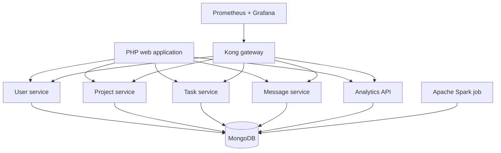

# NeuroTask

> Academic team project and portfolio case study for task and project management using microservices, containerization, observability, and distributed analytics.

## Overview

NeuroTask is a collaborative project-management application created during a university course. It allows users to create projects, organize tasks, assign team members, exchange task messages, and review productivity indicators.

The repository is preserved as an academic and portfolio project. Its purpose is to demonstrate the design and integration of several backend services—not to represent a commercial production system.

## Main features

- User registration and login
- Project and team-member management
- Kanban-style task tracking
- Task assignment, priorities, deadlines, and notifications
- Task discussion messages
- User productivity analytics with Apache Spark
- API routing and metrics through Kong
- Monitoring with Prometheus and Grafana
- Reproducible local environment with Docker Compose

## Architecture



## Technology stack

| Area | Technologies |
|---|---|
| Frontend | PHP, HTML, CSS, JavaScript, Bootstrap |
| Backend | Node.js, Express, Mongoose |
| Database | MongoDB |
| Analytics | PySpark, MongoDB Spark Connector |
| API gateway | Kong |
| Observability | Prometheus, Grafana |
| Infrastructure | Docker, Docker Compose |

## Repository structure

```text
.
├── frontNeuroTask/     # PHP web interface
├── microUser/          # Users and authentication
├── microProjects/      # Projects and memberships
├── microTask/          # Tasks and notifications
├── microMensajes/      # Task messages
├── microAnalisis/      # Analytics API
├── SparkAnalytics/     # Batch productivity analytics
├── docker-compose.yml
├── kong.yaml
└── prometheus.yml
```

## Run locally

### Requirements

- Docker Desktop or Docker Engine
- Docker Compose v2

### Setup

1. Clone the repository.

   ```bash
   git clone https://github.com/StevenVegaL/NeuroTask.git
   cd NeuroTask
   ```

2. Create the local environment file.

   ```bash
   cp .env.example .env
   ```

3. Replace every example password in `.env` with a strong local value. Keep `MONGO_URI` consistent with the MongoDB username and password.

4. Build and start the application.

   ```bash
   docker compose up --build
   ```

5. Open the local services:

   - Web application: http://localhost:8080
   - Kong proxy: http://localhost:8000
   - Prometheus: http://localhost:9090
   - Grafana: http://localhost:3000

All published ports bind to `127.0.0.1` by default. MongoDB and the Node.js services remain inside the Docker network.

## Run the analytics job

The Spark job is intentionally configured as an on-demand Compose profile:

```bash
docker compose --profile analytics run --rm sparkanalytics
```

It calculates task completion, active workload, average completion time, priority distribution, delivery delays, and user efficiency.

## Security and repository hygiene

- No real credentials or local database files should be committed.
- Password hashes are excluded from user API responses.
- Configuration is supplied through environment variables.
- MongoDB and administrative service ports are not published externally.
- `node_modules`, local data, logs, and `.env` files are ignored.

See [SECURITY.md](SECURITY.md) for reporting guidance.

## Academic context

This application was developed as a university team project to apply concepts related to:

- Microservice decomposition
- REST API integration
- Distributed data processing
- Containers and service networking
- API gateways
- Monitoring and operational metrics

Because it is an academic prototype, future improvements include token-based authentication, role-based authorization, automated tests, CI/CD, and stronger cross-service consistency.

## Author

Repository maintained by [Steven López](https://github.com/StevenVegaL).

The original application was created as a collaborative university project.
